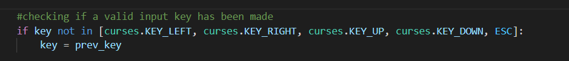
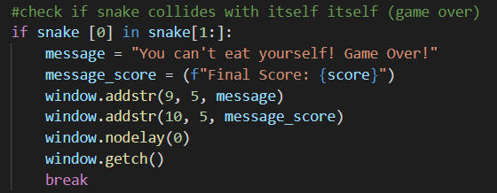
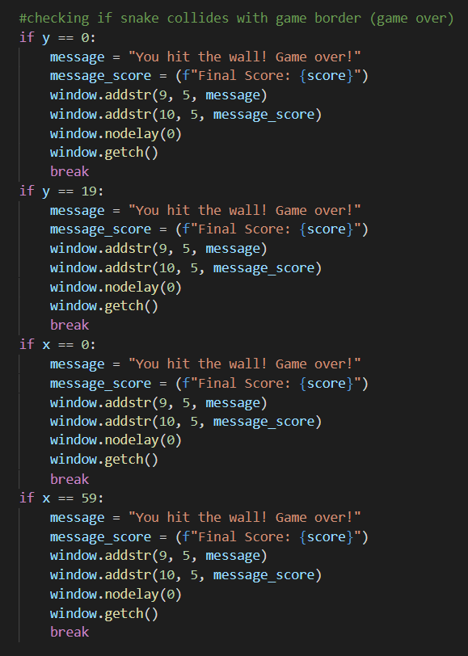
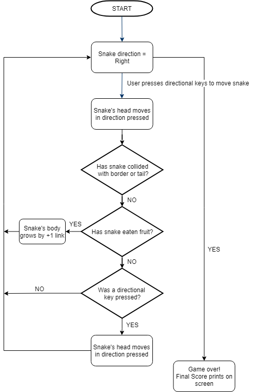

# Statement of Purporse and Scope

Author: Hope Widdows

Language: Python

This is a version if the clssic game ["Snake"](https://blogs.windows.com/devices/2012/02/02/snake-charmed-10-fascinating-facts-about-the-worlds-most-popular-game/) built to be run as a terminal application using Python language and the Curses library (included within Python).

The game runs automatically once the ['snake.py'](snake.py) file is run. Using the UP, DOWN, LEFT and RIGHT directional keys, the player moves the snake around the gameboard. The purpose is to 'eat' the fruits that randomly appear on the screen and grow the snake's body. As the snake grows, the game moves faster and becomes more challenging. If the snake's 'head' touches any part of it's own body, or the borders of the game screen, the game will be over. 

The challenge is to continue as long as possible without the game ending, and reaching a high score. The score increases by 5 points each time a 'fruit' is eaten and is visible at the top of the game screen.

The game is designed to be simple, fun and interactive.This application provides a free version of the classic game, available to run on Windows, Linux and Mac operating systems. This enables it to be played by a wide range or people, and at no cost.

The target audience is anyone who enjoys a simple game. It might be someone that knows the game as it was played on older Nokia phones, seeking a nostaglic hit, or someone that's never played the game at all. It's a 'classic' for a reason, almost everyone enjoys a good game of Snake!

# Features
### Curses
- This app uses the [curses library](https://docs.python.org/3/howto/curses.html) to enable use of key inputs by user and screen manipulation to give the user a perception of animation on the screen
- Error handling is used to check for valid user input of the keys, if an invalid key is entered, the loop will simply start over and continue until a correct key is used

  

### Snake - Collision with itself
- The game is designed so that if the snake's head returns onto itself, it 'dies' and ends the game. As part of the game's purpose and functionality, this in itself is error handling. If the snake was not to stop at this point, an integral part of the game's challenge and purpose would not have been implemented.

  

### Snake - Collision with borders
- The game is designed so that if the snake's head touches any of the outside borders, it 'dies' and ends the game. As part of the game's purpose and functionality, this in itself is error handling. If the snake was not to stop and end the game at this point, the snake itself would continue out of the game screen, and the game would not be able to continue.

  

# User Interaction and Experience
Unfortunately I have failed to complete this build to the standard at which I had planned. There was to be a clear Start Menu, offering options to:
- read instructions on how to play the game
- play in two different game modes
  
As these features were not completed before submission, the clarity on how to use the application for the user is sub-optimal. 
  
The user will need to rely on the [HELP.md](HELP.md) file for instructions on how the game is played at this, unfinished stage of the build.

  
# Control Flow Diagram

# Bibliography
- Blog, M. D. (2015, October 1). Snake charmed! 10 fascinating facts about the world’s most popular game. Microsoft Devices Blog. https://blogs.windows.com/devices/2012/02/02/snake-charmed-10-fascinating-facts-about-the-worlds-most-popular-game/
- Curses Programming with Python — Python 3.9.6 documentation. (n.d.). Python.Org. Retrieved July 20, 2021, from https://docs.python.org/3/howto/curses.html